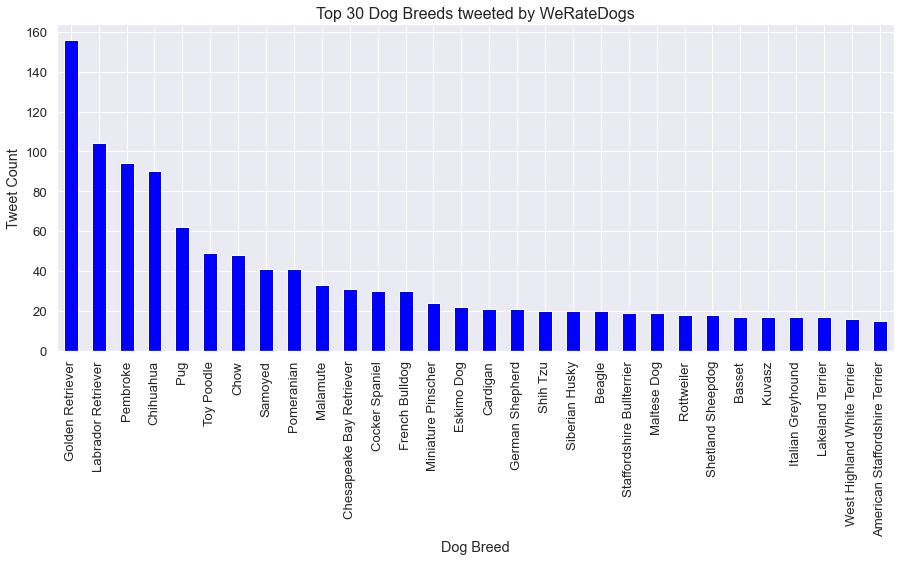
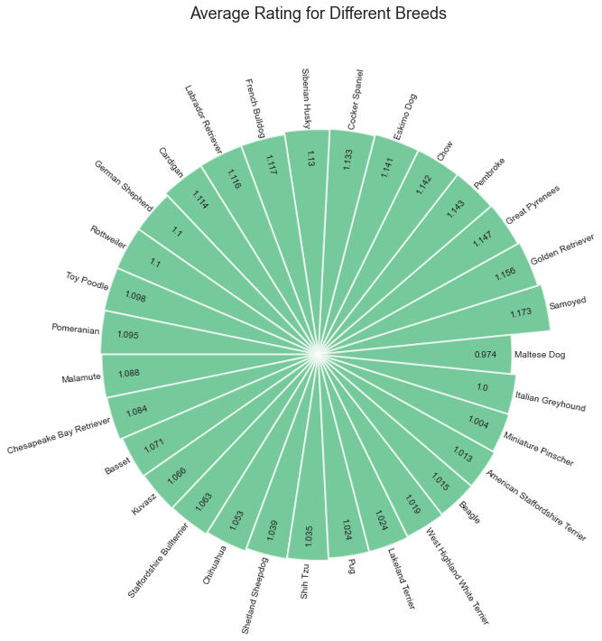
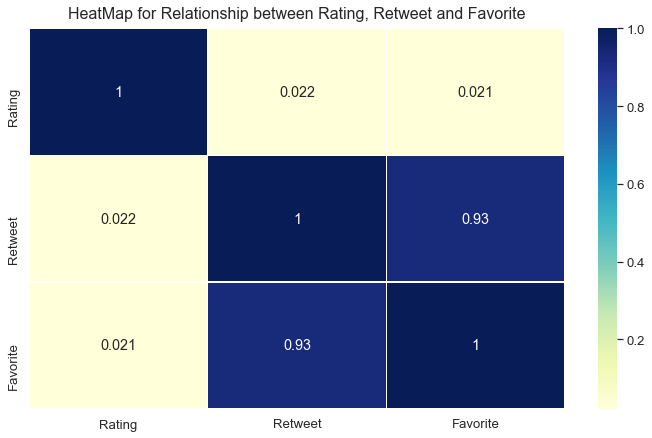
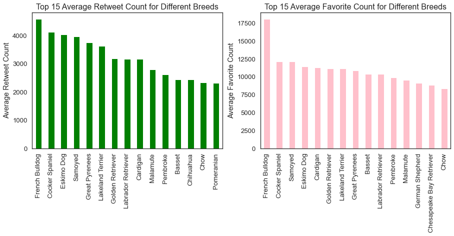

---
output:
  html_document:
    collapse: yes
    highlight: tango
    includes:
      in_header: hero-image.html
      after_body: footer.html
    number_sections: no
    smooth_scroll: yes
    theme: flatly
    toc: yes
    toc_float: yes
  pdf_document:
    toc: yes
---

```{r setup, include=FALSE}
knitr::opts_chunk$set(echo = TRUE,message=FALSE)
```

# How do WeRateDogs rates dogs?

<a style="text-decoration: none" href="https://twitter.com/dog_rates" target="_blank">**WeRateDogs**</a> is a Twitter account that asks people to send photos of their dogs, then tweets on selected photos, gives rating and a humorous comment. Dogs are rated on a scale of one to ten, but are invariably given ratings in excess of the maximum, such as 13/10, 14/10., etc. Why? Because,

<center><font size="5" style="font-family: times, serif; font-style:italic"><a style="text-decoration: none" href="https://knowyourmeme.com/memes/theyre-good-dogs-brent" target="_blank">they're good dogs Brent</a></font></center>


Popular posts are re-posted on Instagram and Facebook. But, how do we measure whether a post is popular or not? Here comes the two notable features,

> * <font size="3">Re-tweet Count
> * Favorite Count</font>

WeRateDogs team receives 800 to 1,000 submissions daily and they work to narrow them down to about one high-quality piece of dog content per day. Among these, which are the breeds considered as <font style="font-family: times, serif; font-style:italic">[Super-WOW](#wow) <a class="fa fa-paw"></a></font> (i.e) highly re-tweeted and favored.

## Total tweets for each Breed

I have analyzed the data available from the starting of WeRateDogs twitter account until August 1, 2017, in order to find out the <font style="font-family: times, serif; font-style:italic,bold">[WOW](#wow)</font> breed.



> * <font size="3">Noticable top breeds being tweeted are, **Golden Retriever, Labrador Retriever, Pembroke, Chihuahua, Pug, Toy Poodle and Chow**
> * Every other breeds gradually decreases in count</font>

## Breeds with Highest Rating

The following graph shows the **top rated** breeds on average, which have been tweeted 14 times at least.

<center>

{width=70%}

</center>

> * <font size="3">Noticable top 5 rated breeds are, **Samoyed, Golden Retriever, Great Pyrenees, Pembroke, and Chow** in order
> * The highly rated **Samoyed** is the $8^{th}$ breed being highly tweeted</font>

### Is Samoyed Super-WOW <i class="fa fa-paw"></i>

Does the breed with highest rating is most likely to have highest Re-tweet and Favorite Count? To find this, the following Heat Map Visualization helps to check the correlation between Rating, Re-tweet and Favorite Count.

<center>

{width=60%}

</center>

> * <font size="3">As the correlation between Rating and either of Re-tweet or Favorite Count is very low, rating is **very less likely** to impact **Re-tweet and Favorite Count**</font>

So, the chances of other breed being Re-tweeted and Favored most is high.

## Here comes the WOW breed

Let's check on average Re-tweet and Favorite Count for top 15 breed. The breed being re-tweeted and favored most on average is considered as <font style="font-family: times, serif; font-style:italic,bold">[WOW](#wow)</font> breed. 



In order to avoid the chance of outliers, I have calculated average re-tweet and favorite count for the breeds, which have been tweeted 14 times at least. Among them, top 15 breed is shown in the  above graph. <br><br>


<div class='col2'>

<a id="wow" class="fa fa-paw" style="font-size:30px"></a>

<center><font size="5" style="font-family: times, serif; font-style:italic;justify-content: center;align-items: center">Here, comes the <br> **[Super WOW - French Bulldog](#wow)** <br> with highest average Re-tweet Count (4585) and average Favorite Count (18083) approximately.</font>


</center>

</div>

<br><br>

<font style="font-family: times, serif; font-style:italic;">**Further Read : <a style="text-decoration: none" href="https://rpubs.com/keer707/WeRateDogs_tweet-factor_blog" target="_blank">What are the other factors that impact Re-tweet & Favorite Count?</a>**</font>


## Additional Info

For further information about the Project,

* <a style="text-decoration: none" href="https://github.com/keer707/Wrangle-WeRateDogs-Twitter" target="_blank">Wrangle-WeRateDogs-Twitter - Repository</a> (Github Repository)
* <a style="text-decoration: none" href="https://github.com/keer707/Wrangle-WeRateDogs-Twitter/blob/master/wrangle_act.ipynb" target="_blank">Wrangle-WeRateDogs-Twitter - Wrangle Act</a> (Jupyter Notebook File)
* <a style="text-decoration: none" href="https://rpubs.com/keer707/759807" target="_blank">Wrangle-WeRateDogs-Twitter - Wrangle Report</a> (Wrangle Report)   

